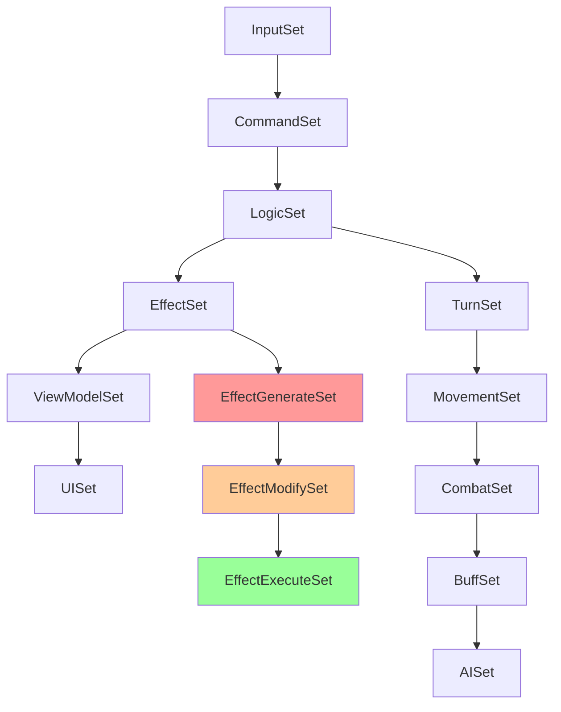

# Bevy Schedule 与 SystemSet 组织

> Version: 1.0
> Status: Proposed
> 来源：`docs/其他/31遗漏.md` Section 二（第77-93行）

---

## 1. 概述

Bevy 的 Schedule 和 SystemSet 是控制**系统执行顺序**的核心机制。90% 的 Bevy 奇怪 Bug 来自系统执行顺序问题。本设计定义：

- 自定义 Schedule 的组织
- SystemSet 层级结构与排序约束
- 关键顺序要求（Damage → Buff → Attribute）
- 状态门控调度
- 并行 vs 顺序执行策略

与 `app-bootstrap.md` 的关系：**本文档是 Schedule/SystemSet 的详细设计，`app-bootstrap.md` 是 App 层的启动装配概览**。本文档定义"系统怎么排"，`app-bootstrap.md` 定义"Plugin 怎么注册"。

---

## 2. 设计

### 2.1 Custom Schedules

在 Bevy 默认 Schedule 之外，项目定义以下自定义 Schedule：

```rust
/// 自定义 Schedule 定义
#[derive(ScheduleLabel, Debug, Clone, PartialEq, Eq, Hash)]
pub struct InputSchedule;

#[derive(ScheduleLabel, Debug, Clone, PartialEq, Eq, Hash)]
pub struct LogicSchedule;

#[derive(ScheduleLabel, Debug, Clone, PartialEq, Eq, Hash)]
pub struct PresentationSchedule;
```

#### Schedule 职责

| Schedule | 职责 | Bevy 内置对应 | 说明 |
|----------|------|-------------|------|
| InputSchedule | 输入处理 | PreUpdate | 读取原始输入，转换为游戏命令 |
| Update（默认） | 游戏逻辑 | Update | 核心业务系统（TurnPhase 控制） |
| LogicSchedule | 复杂逻辑编排 | — | Effect Pipeline、战斗结算等需要严格顺序的逻辑 |
| PresentationSchedule | 表现层 | PostUpdate | UI 更新、动画、音效 |
| FixedUpdate | 固定步长逻辑 | FixedUpdate | 物理、动画帧（当前未使用） |

> ⚠️ **§1.1.7 使用说明**：`LogicSchedule` 仅用于 Effect Pipeline 等需要严格串行的子系统（通过 `world.run_schedule()` 触发）。**常规业务逻辑应放在 `Update` 中通过 SystemSet 控制顺序**，不应创建额外的自定义 Schedule。避免为每个功能模块创建独立 Schedule（违反 §1.1.7 只解决当前复杂度原则）。

#### Schedule 注册

```rust
app.add_schedule(InputSchedule)
    .add_schedule(LogicSchedule)
    .add_schedule(PresentationSchedule);
```

#### Schedule 执行顺序

```
每帧执行顺序：
PreUpdate → InputSchedule → Update → LogicSchedule → PostUpdate → PresentationSchedule → Last
```

---

### 2.2 SystemSet 层级结构

```
InputSet
  ├── KeyboardInputSet      # 键盘输入
  ├── MouseInputSet         # 鼠标输入
  └── TouchInputSet         # 触摸输入

CommandSet
  └── CommandDispatchSet    # 命令分发

LogicSet
  ├── TurnSet               # 回合管理
  ├── MovementSet           # 移动与寻路
  ├── CombatSet             # 战斗逻辑
  ├── BuffSet               # Buff 管理
  └── AISet                 # AI 决策

EffectSet
  ├── EffectGenerateSet     # 效果生成
  ├── EffectModifySet       # 效果修饰
  └── EffectExecuteSet      # 效果执行

ViewModelSet
  ├── BattleViewModelSet    # 战斗视图模型
  ├── BuffViewModelSet      # Buff 视图模型
  └── TurnViewModelSet      # 回合视图模型

UISet
  ├── BattleUISet           # 战斗 UI 面板
  ├── BuffUISet             # Buff UI 面板
  └── DebugUISet            # 调试 UI 面板
```

#### 层次化 SystemSet 完整注册示例

> **优化来源**：`docs/其他/66.md` — 层次化 SystemSet 三层嵌套注册与并行安全策略

下图展示三层嵌套的 SystemSet 结构，以及每层如何映射到具体系统。第一层定义执行阶段，第二层定义功能域，第三层定义管线步骤：

```rust
// ═══ 第一层：顶层 Set（阶段级） ═══
app.configure_sets(Update, (
    InputSet,
    CommandSet.after(InputSet),
    LogicSet.after(CommandSet),
    EffectSet.after(LogicSet),
    ViewModelSet.after(EffectSet),
    UISet.after(ViewModelSet),
).run_if(in_state(AppState::InGame)));

// ═══ 第二层：LogicSet 内部（功能域级） ═══
app.configure_sets(LogicSet, (
    TurnSet,                    // 回合管理（最优先）
    MovementSet.after(TurnSet), // 移动在回合之后
    CombatSet.after(MovementSet), // 战斗在移动之后
    BuffSet.after(CombatSet),   // Buff 在战斗之后
    AISet.after(BuffSet),       // AI 在 Buff 之后
));

// ═══ 第三层：CombatSet 内部（管线级） ═══
app.configure_sets(CombatSet, (
    TargetSelectionSet,                          // 目标选择
    DamageCalculationSet.after(TargetSelectionSet), // 伤害计算
    BuffApplicationSet.after(DamageCalculationSet), // Buff 应用
));

// ═══ EffectSet 内部（效果管线级） ═══
// 详见 EffectPipelineSchedule 章节

// ═══ 系统注册到具体 Set ═══
app.add_systems(LogicSet, (
    turn_system.in_set(TurnSet),
    movement_system.in_set(MovementSet),
    target_selection_system.in_set(CombatSet).in_set(TargetSelectionSet),
    damage_calculation_system.in_set(CombatSet).in_set(DamageCalculationSet),
    buff_application_system.in_set(CombatSet).in_set(BuffApplicationSet),
    buff_tick_system.in_set(BuffSet),
    ai_decision_system.in_set(AISet),
));
```

并行安全的关键：同一层级内无 `after/before` 约束的系统可被 Bevy 自动并行化。例如 `TurnSet` 和 `MovementSet` 虽然有顺序依赖，但 `AISet` 内部的多个 AI 系统（不同 Entity）可以并行：

```rust
// ✅ 安全：不同 Entity 的 AI 系统可并行
app.add_systems(AISet, (
    ai_decision_system_a,  // 处理 Unit A 的 AI
    ai_decision_system_b,  // 处理 Unit B 的 AI
    // Bevy 自动分析：两个系统读写不同 Entity → 并行执行
));
```

#### Set 排序定义

> **优化来源**：`docs/其他/35.md` — `.chain()` 致命性能陷阱

🟥 **所有 Set 排序使用 `after()`/`before()` 约束，禁止使用 `.chain()`。`.chain()` 强制串行执行，彻底破坏 Bevy 多线程并行优势。**

```rust
app.configure_sets(Update, (
    InputSet,
    CommandSet.after(InputSet),
    LogicSet.after(CommandSet),
    EffectSet.after(LogicSet),
    ViewModelSet.after(EffectSet),
    UISet.after(ViewModelSet),
));

// LogicSet 内部排序
app.configure_sets(LogicSet, (
    TurnSet,
    MovementSet.after(TurnSet),
    CombatSet.after(MovementSet),
    BuffSet.after(CombatSet),
    AISet.after(BuffSet),
));

// EffectSet 内部排序 — 使用 EffectPipelineSchedule 替代 .chain()
// 详见下方「EffectPipelineSchedule」章节
```

#### ⚠️ `.chain()` 性能陷阱警告

```
┌─────────────────────────────────────────────────────────┐
│  Bevy 中 .chain() 会强制所有系统串行执行，              │
│  彻底破坏调度器的多线程并行能力。                        │
│                                                         │
│  唯一合法使用场景：单系统管道（无其他系统可并行）。       │
│  多系统管道必须使用 after()/before() 显式约束。          │
│                                                         │
│  违反后果：同屏 20+ 单位结算时帧率线性暴跌。             │
└─────────────────────────────────────────────────────────┘

---

### 2.3 关键顺序约束

#### 必须严格顺序执行的系统

| 先执行 | 后执行 | 强制等级 | 原因 |
|--------|--------|---------|------|
| `damage_calculation` | `buff_application` | 🟥 | 伤害必须在 Buff 应用前完成 |
| `buff_application` | `attribute_recalculate` | 🟥 | Buff 修改属性后需重算 |
| `effect_generate` | `effect_modify` | 🟥 | 管线三步顺序 |
| `effect_modify` | `effect_execute` | 🟥 | 管线三步顺序 |
| `combat_intent_system` | `effect_generate` | 🟥 | 意图必须在效果前 |
| `turn_end_cleanup` | `victory_check` | 🟥 | 清理后才能正确判定 |
| `victory_check` | `round_end` | 🟥 | 判定后才能结束回合 |
| `all logic systems` | `view_model_update` | 🟥 | 逻辑完成后刷新 UI |
| `view_model_update` | `ui_render` | 🟥 | 模型更新后渲染 |

#### 可以并行执行的系统

| 系统组 | 并行条件 | 说明 |
|--------|---------|------|
| KeyboardInput + MouseInput + TouchInput | 读取不同资源 | 输入处理互相独立 |
| BattleViewModel + BuffViewModel + TurnViewModel | 读取不同组件 | 视图模型互不依赖 |
| BattleUISet + BuffUISet | 读取不同 ViewModel | UI 面板互不依赖 |
| AI 决策（不同单位） | 读写不同 Entity | 可并行但需注意共享状态 |

#### 禁止并行的系统

| 系统组 | 原因 |
|--------|------|
| effect_generate ↔ effect_modify | 严格顺序依赖 |
| effect_modify ↔ effect_execute | 严格顺序依赖 |
| damage_calculation ↔ buff_application | 严格顺序依赖 |
| 任意写同一 Resource 的系统 | 数据竞争 |

> **优化来源**：`docs/其他/35.md` — EffectPipelineSchedule 自定义 Schedule 方案

#### EffectPipelineSchedule：严格串行管线的正确实现

🟥 **效果管线（Generate→Modify→Execute）是唯一需要严格串行的子系统。使用自定义 Schedule + `world.run_schedule()` 实现，而非在 Update 中 `.chain()`。**

```rust
/// 效果管线专属 Schedule。
/// 在 Update 中通过 run_schedule 手动触发，保证 Generate→Modify→Execute
/// 严格串行，但不占用 Update 的并行能力。
#[derive(ScheduleLabel, Debug, Clone, PartialEq, Eq, Hash)]
pub struct EffectPipelineSchedule;

// 1. 注册 Schedule
app.add_schedule(EffectPipelineSchedule);

// 2. 配置内部顺序（使用 after()，不用 .chain()）
app.configure_sets(EffectPipelineSchedule, (
    EffectGenerateSet,
    EffectModifySet.after(EffectGenerateSet),
    EffectExecuteSet.after(EffectModifySet),
));

// 3. 在 Update 中触发
fn trigger_effect_pipeline(world: &mut World) {
    world.run_schedule(EffectPipelineSchedule);
}
```

#### Effect Pipeline 三步严格顺序的完整示例

> **优化来源**：`docs/其他/66.md` — Effect Pipeline 三步严格顺序与系统注册

Effect Pipeline 的 Generate→Modify→Execute 必须严格串行。以下是完整的系统注册示例，展示每个步骤包含哪些系统：

```rust
// 1. 注册专属 Schedule
#[derive(ScheduleLabel, Debug, Clone, PartialEq, Eq, Hash)]
pub struct EffectPipelineSchedule;

app.add_schedule(EffectPipelineSchedule);

// 2. 配置管线三步顺序（使用 after()，不用 .chain()）
app.configure_sets(EffectPipelineSchedule, (
    EffectGenerateSet,
    EffectModifySet.after(EffectGenerateSet),
    EffectExecuteSet.after(EffectModifySet),
));

// 3. 注册各步骤的系统
app.add_systems(EffectPipelineSchedule, (
    // ── Generate 步骤：生成效果数据（纯计算，不修改属性） ──
    damage_effect_generation.in_set(EffectGenerateSet),
    buff_effect_generation.in_set(EffectGenerateSet),
    heal_effect_generation.in_set(EffectGenerateSet),

    // ── Modify 步骤：修饰效果数据（暴击/克制/地形加成） ──
    critical_modifier.in_set(EffectModifySet),
    element_resistance_modifier.in_set(EffectModifySet),
    terrain_bonus_modifier.in_set(EffectModifySet),

    // ── Execute 步骤：执行效果（修改 World 状态） ──
    apply_damage.in_set(EffectExecuteSet),
    apply_buff.in_set(EffectExecuteSet),
    apply_heal.in_set(EffectExecuteSet),
));

// 4. 在 Update 中触发管线（不占用 Update 的并行能力）
fn trigger_effect_pipeline(world: &mut World) {
    world.run_schedule(EffectPipelineSchedule);
}
```

收益：效果管线严格串行的同时，Update 中的其他系统（UI、输入）仍然可以并行执行。

---

### 2.4 状态门控调度

大多数系统只在特定 AppState 和 BattlePhase 下运行。

#### AppState 门控

```rust
// 所有战斗系统只在 InGame 时运行
app.configure_sets(Update, (
    LogicSet,
    EffectSet,
    ViewModelSet,
).run_if(in_state(AppState::InGame)));

// UI 系统在所有状态运行
app.configure_sets(Update, (
    UISet,
).run_if(in_state(AppState::MainMenu).or_else(
    in_state(AppState::InGame)).or_else(
    in_state(AppState::GameOver))));
```

#### BattlePhase 门控

```rust
// 回合管理只在 RoundStart/TurnEnd 时运行
app.configure_sets(LogicSet, (
    TurnSet.run_if(in_state(BattlePhase::RoundStart)
        .or_else(in_state(BattlePhase::TurnEnd))),
));

// 战斗逻辑只在 PlayerPhase/EnemyPhase 时运行
app.configure_sets(LogicSet, (
    CombatSet.run_if(in_state(BattlePhase::PlayerPhase)
        .or_else(in_state(BattlePhase::EnemyPhase))),
));

// 效果管线只在 PlayerPhase/EnemyPhase 时运行
app.configure_sets(EffectSet, (
    EffectGenerateSet.run_if(in_state(BattlePhase::PlayerPhase)
        .or_else(in_state(BattlePhase::EnemyPhase))),
));
```

#### TurnPhase 门控

```rust
// 移动系统只在 MoveUnit 阶段运行
app.configure_sets(MovementSet, (
    MovementSet.run_if(in_state(TurnPhase::MoveUnit)),
));

// 目标选择只在 SelectTarget 阶段运行
app.configure_sets(CombatSet, (
    TargetSelectionSet.run_if(in_state(TurnPhase::SelectTarget)),
));
```

#### 三级状态门控完整示例（AppState + BattlePhase + TurnPhase）

> **优化来源**：`docs/其他/66.md` — 三级状态门控精确控制与谓词门控

下图展示三层门控如何协同工作，逐层收窄系统执行范围：

```
AppState::InGame          ← 第一层：全局状态门控
  └─ BattlePhase::PlayerPhase   ← 第二层：战斗阶段门控
       └─ TurnPhase::SelectTarget  ← 第三层：回合阶段门控
```

完整注册示例：

```rust
// ═══ 第一层：AppState 全局门控 ═══
// 所有战斗系统只在 InGame 时运行
app.configure_sets(Update, (
    LogicSet,
    EffectSet,
    ViewModelSet,
).run_if(in_state(AppState::InGame)));

// ═══ 第二层：BattlePhase 战斗阶段门控 ═══
// 战斗逻辑只在 PlayerPhase/EnemyPhase 时运行
app.configure_sets(LogicSet, (
    CombatSet.run_if(in_state(BattlePhase::PlayerPhase)
        .or_else(in_state(BattlePhase::EnemyPhase))),
    BuffSet.run_if(in_state(BattlePhase::PlayerPhase)
        .or_else(in_state(BattlePhase::EnemyPhase))),
));

// 回合管理只在 RoundStart/TurnEnd 时运行
app.configure_sets(LogicSet, (
    TurnSet.run_if(in_state(BattlePhase::RoundStart)
        .or_else(in_state(BattlePhase::TurnEnd))),
));

// ═══ 第三层：TurnPhase 回合阶段门控 ═══
// 目标选择只在 SelectTarget 阶段运行
app.configure_sets(CombatSet, (
    TargetSelectionSet.run_if(in_state(TurnPhase::SelectTarget)),
));

// 伤害计算只在 ExecuteAction 阶段运行
app.configure_sets(CombatSet, (
    DamageCalculationSet.run_if(in_state(TurnPhase::ExecuteAction)),
));

// 移动只在 MoveUnit 阶段运行
app.configure_sets(MovementSet, (
    MovementSet.run_if(in_state(TurnPhase::MoveUnit)),
));

// ═══ 组合门控示例：三层层叠 ═══
// 效果管线同时受三个状态门控
app.configure_sets(EffectSet, (
    EffectGenerateSet
        .run_if(in_state(AppState::InGame))
        .run_if(in_state(BattlePhase::PlayerPhase)
            .or_else(in_state(BattlePhase::EnemyPhase)))
        .run_if(in_state(TurnPhase::ExecuteAction)),
));
```

关键原则：
- 🟥 **禁止在 System 内部手动检查状态**：`if *phase.get() != TurnPhase::SelectTarget { return; }` 是错误的
- 🟩 **所有门控必须通过 `run_if` 在调度阶段完成**：Bevy 在图构建阶段直接裁剪不需要的系统，零运行时开销

```rust
// 🟥 禁止：System 内部手动检查状态
fn target_selection_system(phase: Res<State<TurnPhase>>) {
    if *phase.get() != TurnPhase::SelectTarget {
        return;  // 每帧浪费一次 Query 遍历
    }
    // ... 业务逻辑
}

// ✅ 正确：通过 run_if 在调度阶段裁剪
// System 注册时已经确保只在 TurnPhase::SelectTarget 运行
fn target_selection_system(/* 无需 phase 参数 */) {
    // ... 纯业务逻辑
}
```

---

### 2.5 FixedTimestep vs 帧依赖

#### 物理无关系统（使用 FixedUpdate）

| 系统 | 原因 |
|------|------|
| 物理模拟 | 需要固定步长保证确定性 |
| 动画帧 | 需要稳定的时间步进 |
| 状态哈希计算 | 需要在固定时机执行 |

#### 帧依赖系统（使用 Update）

| 系统 | 原因 |
|------|------|
| 输入处理 | 必须每帧响应 |
| UI 渲染 | 必须每帧更新 |
| ViewModel 更新 | 必须反映最新状态 |

#### 当前决策

> **优化来源**：`docs/其他/35.md` — FixedUpdate Set 划分建议

```
SRPG 是回合制游戏，战斗逻辑不需要固定步长。
所有战斗系统使用 Update Schedule，通过 SystemSet 控制顺序。
FixedUpdate 仅用于未来可能的物理/动画需求。
```

🟥 **确定性战斗结算应放在 FixedUpdate 中（固定 10Hz tick），Update 只处理输入和 UI 表现。避免帧率波动影响战斗数值，这是网络同步、战斗回放的基础。**

```
FixedUpdate Schedule（确定性逻辑层，10Hz 固定 tick）
  ├── LogicFixedSet      # 确定性战斗结算
  ├── PhysicsFixedSet     # 物理模拟（未来）
  └── AnimationFixedSet   # 动画帧推进（未来）

Update Schedule（表现层，可变帧率）
  ├── InputSet            # 输入处理
  ├── UISet               # UI 渲染
  └── ViewModelSet        # 视图模型刷新
```

关键约束：
- 🟥 确定性逻辑禁止读取 `Time::delta_seconds()` 等浮点时间，所有时间推进必须基于离散的 Tick/Frame 计数
- 🟥 确定性随机（`GameRng`）只允许在 FixedUpdate 的逻辑帧中调用，Update 中的 UI/动画绝对不能碰游戏随机数

---

## 3. 不变量

> **优化来源**：`docs/其他/66.md` — 五条核心不变量具体代码示例与 DAG 校验

### 不变量1：所有系统必须归属某个 Set

```
每个 System 必须通过 configure_sets 归属到某个 SystemSet。
禁止：系统无 Set 归属直接注册
```

```rust
// 🟥 禁止：系统无 Set 归属直接注册
app.add_systems(Update, my_orphan_system);  // 无 Set 归属

// ✅ 正确：每个系统必须归属到某个 Set
app.add_systems(Update, (
    my_system.in_set(LogicSet).in_set(CombatSet),
));
```

### 不变量2：Set 间依赖必须显式声明

```
Set 之间的 after/before 依赖必须在 configure_sets 中声明。
禁止：依赖隐式执行顺序
```

```rust
// 🟥 禁止：依赖隐式执行顺序
app.add_systems(Update, (system_a, system_b));  // 无顺序约束

// ✅ 正确：显式声明依赖
app.configure_sets(Update, (
    SetA,
    SetB.after(SetA),  // 显式声明 SetB 在 SetA 之后
));
```

### 不变量3：不能存在循环依赖（DAG 检查）

```
Set 依赖图必须是 DAG（有向无环图）。
禁止：A.after(B) 且 B.after(A)
```

```rust
// 🟥 禁止：循环依赖（Bevy 会 panic）
app.configure_sets(Update, (
    SetA.after(SetB),
    SetB.after(SetA),  // 💥 循环依赖！Bevy panic
));

// ✅ 校验方法：在测试中验证 DAG
#[test]
fn test_schedule_dag_valid() {
    let mut app = App::new();
    app.add_plugins(MinimalPlugins);
    setup_schedules(&mut app);

    // Bevy 内置校验：如果存在循环依赖，app.update() 会 panic
    // 测试通过即表示 DAG 有效
    app.update();
}

// ✅ 辅助工具：使用 bevy_mod_debugdump 导出依赖图进行人工审查
// cargo run --bin schedule_dumper -- --format mermaid > schedule_graph.md
```

### 不变量4：Effect Pipeline 三步必须严格顺序

```
EffectGenerate → EffectModify → EffectExecute 必须严格顺序执行。
禁止：并行执行管线三步
禁止：跳过任何一步
```

```rust
// 🟥 禁止：三步并行执行
app.add_systems(EffectSet, (
    effect_generate,
    effect_modify,   // 💥 与 generate 并行！
    effect_execute,  // 💥 与 modify 并行！
));

// ✅ 正确：严格顺序（通过 EffectPipelineSchedule 实现）
app.configure_sets(EffectPipelineSchedule, (
    EffectGenerateSet,
    EffectModifySet.after(EffectGenerateSet),
    EffectExecuteSet.after(EffectModifySet),
));
```

### 不变量5：LogicSet 必须在 EffectSet 之前

```
所有业务逻辑系统必须在效果管线系统之前执行。
禁止：EffectSet 在 LogicSet 之前
```

```rust
// 🟥 禁止：EffectSet 在 LogicSet 之前
app.configure_sets(Update, (
    EffectSet,
    LogicSet.after(EffectSet),  // 💥 业务逻辑在效果之后
));

// ✅ 正确：LogicSet 在 EffectSet 之前
app.configure_sets(Update, (
    LogicSet,
    EffectSet.after(LogicSet),  // 业务逻辑完成后才执行效果
));
```

---

## 4. 禁止事项

| 禁止项 | 理由 | 违反后果 |
|--------|------|---------|
| 🟥 系统无 Set 归属直接注册 | 无法控制执行顺序 | 竞态条件 |
| 🟥 Set 间依赖不显式声明 | 顺序隐式依赖 | 不确定性 |
| 🟥 Set 循环依赖 | 调度器死锁 | 游戏卡死 |
| 🟥 Effect Pipeline 三步并行 | 严格顺序依赖 | 效果错误 |
| 🟥 在 PreUpdate 中执行游戏逻辑 | PreUpdate 专用于输入 | 职责混乱 |
| 🟥 在 PostUpdate 中修改游戏状态 | PostUpdate 专用于 UI | 状态不一致 |
| 🟥 系统依赖顺序但不声明 | Bevy 不保证隐式顺序 | 间歇性 Bug |
| 🟥 所有系统串行执行 | 浪费并行能力 | 性能低下 |
| 🟥 在多系统管道中使用 `.chain()` | 强制串行，破坏并行 | 同屏结算帧率暴跌 |
| 🟥 确定性逻辑放在 Update 而非 FixedUpdate | 帧率波动影响数值 | 回放不同步 |

---

## 5. Schedule 注册规范

### 完整注册示例

```rust
impl Plugin for AppPlugin {
    fn build(&self, app: &mut App) {
        // 1. 注册自定义 Schedule
        app.add_schedule(InputSchedule)
            .add_schedule(LogicSchedule)
            .add_schedule(PresentationSchedule);

        // 2. 配置顶层 Set 排序
        app.configure_sets(Update, (
            InputSet,
            CommandSet.after(InputSet),
            LogicSet.after(CommandSet),
            EffectSet.after(LogicSet),
            ViewModelSet.after(EffectSet),
            UISet.after(ViewModelSet),
        ).run_if(in_state(AppState::InGame)));

        // 3. 配置 LogicSet 内部排序
        app.configure_sets(LogicSet, (
            TurnSet,
            MovementSet.after(TurnSet),
            CombatSet.after(MovementSet),
            BuffSet.after(CombatSet),
            AISet.after(BuffSet),
        ));

        // 4. 配置 EffectSet 内部排序
        app.configure_sets(EffectSet, (
            EffectGenerateSet,
            EffectModifySet.after(EffectGenerateSet),
            EffectExecuteSet.after(EffectModifySet),
        ));

        // 5. 注册系统到对应 Set
        app.add_systems(LogicSet, (
            turn_system.in_set(TurnSet),
            movement_system.in_set(MovementSet),
            combat_system.in_set(CombatSet),
        ));

        app.add_systems(EffectSet, (
            effect_generate.in_set(EffectGenerateSet),
            effect_modify.in_set(EffectModifySet),
            effect_execute.in_set(EffectExecuteSet),
        ));
    }
}
```

---

## 6. 交叉引用

| 文档 | 关系 |
|------|------|
| `docs/01-architecture/00-overview/app-bootstrap.md` | App 层启动装配、Plugin 注册顺序 |
| `docs/01-architecture/battle_fsm_design.md` | FSM 状态转换依赖 Schedule 执行 |
| `docs/01-architecture/determinism_rules.md` | 系统执行顺序是确定性的基础 |
| `docs/02-domain/turn_rules.md` | TurnPhase 内的系统顺序 |
| `docs/02-domain/battle_rules.md` | Effect Pipeline 的执行顺序 |
| `docs/01-architecture/README.md` | 效果管线三步顺序 |

---

## 7. SystemSet 依赖图可视化方法

> **优化来源**：`docs/其他/66.md` — 调度依赖图可视化与 Mermaid/DOT 导出工具集成

### 7.1 为什么需要可视化

大型项目的 SystemSet 依赖图会变得像蜘蛛网一样复杂。一旦产生意外的隐式串行，性能暴跌且极难排查。可视化工具能让主程一眼看出哪些 SystemSet 被意外阻塞。

### 7.2 使用 bevy_mod_debugdump 导出

```toml
# Cargo.toml
[target.'cfg(debug_assertions)'.dependencies]
bevy_mod_debugdump = "0.12"
```

```rust
// tools/schedule_dumper/src/main.rs
use bevy_mod_debugdump::ScheduleGraphSettings;

fn main() {
    let mut app = App::new();
    app.add_plugins(MinimalPlugins);
    // 注册项目的所有 Schedule 和 SystemSet
    setup_schedules(&mut app);

    // 导出为 DOT 格式
    let dot = bevy_mod_debugdump::schedule_graph(
        &app.world(),
        Update,  // 指定要导出的 Schedule
        &ScheduleGraphSettings::default(),
    );
    std::fs::write("schedule_graph.dot", &dot).unwrap();

    // 转换为 Mermaid 格式（可选）
    let mermaid = dot_to_mermaid(&dot);
    std::fs::write("schedule_graph.md", &mermaid).unwrap();
}
```

### 7.3 Mermaid 格式输出示例

导出的依赖图可直接嵌入文档或 Wiki：



### 7.4 CI 集成

```yaml
# .github/workflows/schedule-audit.yml
- name: Export Schedule Graph
  run: |
    cargo run --bin schedule_dumper
    # 上传到 Wiki 或 PR 评论
    cat schedule_graph.md >> $GITHUB_STEP_SUMMARY
```

### 7.5 性能热力图集成

结合 Tracy Profiler 或 bevy_profiler，可在可视化图中标注每个 Set 的执行耗时：

```rust
// 监控各 Set 执行时间
#[derive(Resource)]
pub struct ScheduleProfiler {
    set_times: HashMap<String, Duration>,
}

fn profile_sets_system(mut profiler: ResMut<ScheduleProfiler>) {
    // 记录当前帧各 Set 的执行时间
    // 超过阈值的 Set 在可视化中标红
}
```

---

## 宪法合规说明

| 条款 | 合规状态 | 说明 |
|------|---------|------|
| 🟩 §2.3.8 Schedule 权责划分 | ✅ 合规 | PreUpdate/Update/PostUpdate 三级划分明确 |
| 🟩 §2.3.6 状态管理 | ✅ 合规 | 使用 States/SubStates 门控系统执行 |
| 🟩 §2.3.7 run_if() 条件 | ✅ 合规 | 所有门控通过 run_if() 在调度阶段完成 |
| 🟩 §2.3.5 性能优化 | ✅ 合规 | 禁止 .chain() 破坏并行，使用 after()/before() |
| 🟥 §1.1.7 避免过度设计 | ⚠️ 需关注 | LogicSchedule 仅用于 Effect Pipeline 串行场景，常规逻辑用 Update + SystemSet |

## 交叉引用

| 文档 | 关系 |
|------|------|
| `docs/01-architecture/00-overview/app-bootstrap.md` | App 层启动装配、Plugin 注册顺序 |
| `docs/01-architecture/battle_fsm_design.md` | FSM 状态转换依赖 Schedule 执行 |
| `docs/01-architecture/determinism_rules.md` | 系统执行顺序是确定性的基础 |
| `docs/02-domain/turn_rules.md` | TurnPhase 内的系统顺序 |
| `docs/02-domain/battle_rules.md` | Effect Pipeline 的执行顺序 |
| `docs/01-architecture/README.md` | 效果管线三步顺序 |
| `docs/AI开发宪法完整版.md` | §2.3.8 Schedule 权责、§2.3.6 状态管理、§2.3.7 run_if()、§1.1.7 避免过度设计 |
