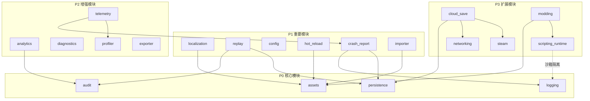

# Infrastructure Layer Design

Version: 1.0
Status: Proposed

来源：`docs/其他/30.md` 架构提炼、`docs/01-architecture/00-overview/layer-contracts.md`、`docs/01-architecture/04-events-logging-error/error-architecture.md`

---

## 1. Infrastructure 哲学

### 1.1 为什么需要 Infrastructure 层

七层架构中，Infrastructure 是**技术实现层**——回答"怎么做"的问题。

游戏规则（Core）是稳定的业务语义，而技术实现是可变的工程选择。将两者分离，使得：

- 存储格式从 JSON 换成二进制，游戏规则不变
- 日志框架从 tracing 换成 slog，游戏规则不变
- Steam 集成从有到无，游戏规则不变
- 网络层从本地模拟换成真实联机，游戏规则不变

### 1.2 可替换性原则

> **核心测试：如果游戏规则不变，能不能换一种实现方式？**
> → 能 → Infrastructure

`docs/其他/30.md` 原文：

> 这些未来都可能：替换、删除、升级。但游戏规则不变。

Infrastructure 模块是**可替换的实现**。每一个模块都应该能够被整体替换，而 Core 层的业务逻辑不受任何影响。

### 1.3 三问判断法（Infrastructure 视角）

| 问题 | 答案 | 归属 |
|------|------|------|
| 删掉 Bevy 后，这个逻辑还存在吗？ | 存在 → 不是 Infrastructure | Core |
| 游戏规则不变，能换一种实现方式吗？ | 能 → Infrastructure | Infrastructure |
| 所有模块都会用到的基础工具吗？ | 是 → 不是 Infrastructure | Shared |

**一句话总结**：Core = 为什么（业务规则），Infrastructure = 怎么做（技术实现），Shared = 通用工具（基础能力）。

### 1.4 Infrastructure vs Core：界限测试

| 场景 | 归属 | 理由 |
|------|------|------|
| 伤害计算公式 | Core | 游戏规则，删掉 Bevy 也存在 |
| 伤害计算的日志记录 | Infrastructure | 技术实现，可换成不同日志方案 |
| 存档序列化格式 | Infrastructure | 可以从 JSON 换成二进制 |
| 存档中保存哪些字段 | Core | 业务决定什么值得保存 |
| AssetServer 加载 RON | Infrastructure | 技术实现，可换成其他加载方式 |
| Buff 过期结算规则 | Core | 游戏规则 |
| 崩溃时的 dump 生成 | Infrastructure | 纯技术行为 |

### 1.5 Infrastructure vs Shared：界限测试

| 特征 | Infrastructure | Shared |
|------|---------------|--------|
| 游戏特定性 | 有游戏特定的关切（如存档格式包含游戏状态） | 完全通用，可用于任何项目 |
| 可替换性 | 可整体替换实现方式 | 不可替换（是基础工具） |
| 依赖 Core | 可以（通过事件） | 绝对禁止 |
| 示例 | persistence（存档） | error（错误类型工具） |

关键区别：**Infrastructure 有游戏特定的关切，Shared 是真正通用的基础能力。**

例如：
- `shared/error/GameResult<T>` — 通用错误工具，任何项目都能用
- `infrastructure/persistence/SaveError` — 游戏存档错误，包含存档特定的失败原因

### 1.6 Infrastructure 错误归属

Infrastructure 错误在 Infrastructure 内部定义，**不放入 Shared**。

```
infrastructure/persistence/save/   → save_error.rs
infrastructure/persistence/load/   → load_error.rs
infrastructure/persistence/migration/ → migration_error.rs
infrastructure/assets/             → asset_error.rs
infrastructure/networking/         → network_error.rs
infrastructure/localization/       → localization_error.rs
```

错误架构详细规则见 `docs/01-architecture/04-events-logging-error/error-architecture.md`。

**红线**：
- 🟥 基础设施错误禁止包含领域语义（`SkillId`、`UnitId` 等）（宪法 §13.9.1 分领域错误原则）
- 🟥 基础设施错误只关注技术层面的失败原因（宪法 §13.9.2 失败分类学）
- 🟥 禁止在 infrastructure/ 中创建全局统一 `AppError` 大枚举（宪法 §13.9.1）

---

## 2. 模块总览

> ⚠️ **宪法 §1.1.7 提醒**：以下模块列表包含未来 P2/P3 模块（如 networking、steam、cloud_save、scripting_runtime 等），这些为预留设计。**禁止在当前阶段提前实现未明确需要的模块**。仅实现 P0/P1 模块，其余在明确需求时再启动。

| # | 模块 | 中文 | 优先级 | 状态 |
|---|------|------|--------|------|
| 1 | logging | 日志 | P0 | ✅ 已实现 |
| 2 | persistence | 存档 | P0 | 🔲 待实现 |
| 3 | assets | 资源加载 | P0 | 🔲 待实现 |
| 4 | localization | 多语言 | P1 | 🔲 待实现 |
| 5 | replay | 战斗回放 | P1 | 🔲 待实现 |
| 6 | analytics | 数据分析 | P2 | 🔲 待实现 |
| 7 | telemetry | 遥测 | P2 | 🔲 待实现 |
| 8 | config | 配置管理 | P1 | 🔲 待实现 |
| 9 | importer | 数据导入 | P1 | 🔲 待实现 |
| 10 | exporter | 数据导出 | P2 | 🔲 待实现 |
| 11 | networking | 网络 | P3 | 🔲 待实现 |
| 12 | steam | Steam 集成 | P3 | 🔲 待实现 |
| 13 | cloud_save | 云存档 | P3 | 🔲 待实现 |
| 14 | hot_reload | 热重载 | P1 | 🔲 待实现 |
| 15 | diagnostics | 诊断 | P2 | 🔲 待实现 |
| 16 | profiler | 性能分析 | P2 | 🔲 待实现 |
| 17 | crash_report | 崩溃报告 | P1 | 🔲 待实现 |
| 18 | scripting_runtime | 脚本运行时 | P3 | 🔲 待实现 |
| 19 | audit | 审计基础设施 | P0 | ✅ 已实现 |
| 20 | modding | MOD 基础设施 | P3 | 🔲 待实现 |

### 模块依赖图（Mermaid）



### 依赖约束矩阵

以下模块对之间**禁止直接依赖**（即使通过间接路径也不允许）：

| 禁止依赖 | 原因 |
|---------|------|
| `hot_reload` → `replay` | 热重载不应感知回放逻辑 |
| `scripting_runtime` → `steam` | 脚本运行时不应直接依赖平台 API |
| `logging` → `persistence` | 日志不应依赖存档（避免循环） |
| `analytics` → `logging` | 数据分析不应依赖日志实现 |
| `profiler` → `diagnostics` | 性能分析不应依赖诊断（职责分离） |

> **优化来源**：`docs/其他/54.md` — 可视化依赖「Mermaid 模块依赖图 + 依赖约束矩阵表」

---

## 3. 模块详细设计

### 3.1 logging（日志）

**职责**：统一日志框架，通过 tracing 提供结构化日志输出，监听领域事件生成日志记录。

**核心设计决策**：
- 使用 `tracing` crate 作为日志框架（禁止 `println!`/`dbg!`）
- 日志基于领域事件驱动：业务代码触发 DomainEvent → LogObserver 监听 → 输出 TracingLog
- 日志记录状态变化，不记录函数进入退出
- 每帧系统中仅允许 Error 级别日志，禁止 Info/Debug

**接口定义**：

```rust
// logging/plugin.rs
pub struct LogPlugin;

impl Plugin for LogPlugin {
    fn build(&self, app: &mut App) {
        // 注册日志相关 Message 和 LogObserver 系统
    }
}
```

**依赖**：
- `shared/error/` — 日志工具函数
- `bevy` — Observer 机制

**禁止事项**：
- 🟥 在每帧系统中打印 Info/Debug 级别日志（宪法 §13.4）
- 🟥 通过堆砌日志进行调试（应使用 Inspector/Replay/Debug Panel）（宪法 §13.7.1）
- 🟥 循环内日志（宪法 §13.4）
- 🟥 使用 `println!`、`dbg!`、`log` crate（宪法 §13.1.1）

**当前状态**：✅ 已实现（`src/infrastructure/logging/`），包含 events.rs、observer.rs。

---

### 3.2 persistence（存档）

**职责**：游戏存档的保存、加载和版本迁移。存档只保存 Instance 数据，Definition 通过 ID 引用从 Registry 恢复。

**核心设计决策**：
- **只保存 Instance**，禁止保存 Definition（Definition 不可变，从配置加载）
- Instance 通过 Definition ID 引用，加载时从 Registry 恢复 Definition
- 存档格式采用 JSON（开发阶段，人类可读、可调试），预留二进制格式选项
- 存档使用 SemVer 版本号，每次格式变更递增版本
- 迁移函数在版本之间提供向后兼容

**接口定义**：

```rust
// persistence/save/mod.rs
pub fn save_game(world: &World, path: impl AsRef<Path>) -> Result<SaveData, SaveError>;

// persistence/load/mod.rs
pub fn load_game(path: impl AsRef<Path>, registries: &Registries) -> Result<SaveData, LoadError>;

// persistence/migration/mod.rs
pub fn migrate(data: SaveData, from: SemVer, to: SemVer) -> Result<SaveData, MigrationError>;
```

**存档序列化抽象 trait**（实现 JSON/二进制切换）：

```rust
pub trait SaveSerializer: Send + Sync {
    fn serialize(&self, data: &SaveData) -> Result<Vec<u8>, SerializeError>;
    fn deserialize(&self, bytes: &[u8]) -> Result<SaveData, DeserializeError>;
    fn format_name(&self) -> &str;
}

/// JSON 实现（开发阶段默认）
pub struct JsonSerializer;
impl SaveSerializer for JsonSerializer {
    fn serialize(&self, data: &SaveData) -> Result<Vec<u8>, SerializeError> {
        serde_json::to_vec_pretty(data).map_err(|e| SerializeError::JsonFailed { reason: e.to_string() })
    }
    fn deserialize(&self, bytes: &[u8]) -> Result<SaveData, DeserializeError> {
        serde_json::from_slice(bytes).map_err(|e| DeserializeError::JsonFailed { reason: e.to_string() })
    }
    fn format_name(&self) -> &str { "json" }
}

/// 二进制实现（生产阶段，预留）
#[cfg(feature = "binary_save")]
pub struct BincodeSerializer;
#[cfg(feature = "binary_save")]
impl SaveSerializer for BincodeSerializer {
    fn serialize(&self, data: &SaveData) -> Result<Vec<u8>, SerializeError> {
        bincode::serialize(data).map_err(|e| SerializeError::BincodeFailed { reason: e.to_string() })
    }
    fn deserialize(&self, bytes: &[u8]) -> Result<SaveData, DeserializeError> {
        bincode::deserialize(bytes).map_err(|e| DeserializeError::BincodeFailed { reason: e.to_string() })
    }
    fn format_name(&self) -> &str { "bincode" }
}
```

**依赖**：
- `shared/error/` — GameResult 类型
- Core 层事件 — 通过 Message 接收存档触发信号

**禁止事项**：
- 🟥 保存 Definition 数据（宪法 §1.1.2 定义与实例分离）
- 🟥 运行时创建新的 Definition
- 🟥 存档格式无版本号（宪法 §12.6.1 强制版本字段）
- 🟥 跨大版本不提供迁移函数（宪法 §12.6.2 向后兼容原则）

**目录结构**：

```
persistence/
├── mod.rs
├── plugin.rs
├── save/
│   ├── mod.rs
│   └── save_error.rs
├── load/
│   ├── mod.rs
│   └── load_error.rs
└── migration/
    ├── mod.rs
    └── migration_error.rs
```

---

### 3.3 assets（资源加载）

**职责**：AssetServer 封装，统一资源加载管线，支持热重载集成和资源错误处理。

**核心设计决策**：
- 封装 Bevy 的 AssetServer，提供统一的资源加载接口
- 内容数据（RON）和二进制资源（图片/音频）使用不同的加载管线
- 所有资源加载必须可追踪、可中断
- 资源生命周期显式管理
- 高频修改的资源优先支持热重载

**接口定义**：

```rust
// assets/loaders/ron_loader.rs
pub fn load_ron<T: DeserializeOwned>(path: impl AsRef<Path>) -> Result<T, AssetError>;

// assets/loaders/manifest_loader.rs
pub fn load_manifest(path: impl AsRef<Path>) -> Result<Manifest, AssetError>;
```

**依赖**：
- `bevy::asset::AssetServer`
- `shared/error/` — 错误工具

**禁止事项**：
- 🟥 绕过 AssetServer 直接读文件（破坏热重载和生命周期管理）
- 🟥 资源路径硬编码
- 🟥 忽略资源加载错误
- 🟥 在 Core 层直接加载资源（Core 只定义规则）

**目录结构**：

```
assets/
├── mod.rs
├── plugin.rs
├── asset_error.rs
└── loaders/
    ├── mod.rs
    ├── ron_loader.rs
    └── manifest_loader.rs
```

---

### 3.4 localization（多语言）

> **详细设计**：参见 `docs/01-architecture/i18n_design.md`（国际化系统架构，含 Fluent/.ftl 方案、Key 驱动机制、MOD 翻译支持）。

**职责**：多语言支持系统，管理 locale、字符串表、字体集成。

**核心设计决策**：
- locale 系统基于语言代码（如 `zh-CN`、`en-US`）
- 字符串表从配置文件加载，支持 fallback 链（如 `zh-CN` → `zh` → `en`）
- 字体集成根据 locale 自动选择合适字体
- 本地化数据是 Definition，不可变

**接口定义**：

```rust
// localization/plugin.rs
pub struct LocalizationPlugin;

// 核心接口
pub fn localize(key: &str, locale: &Locale) -> String;
pub fn set_locale(locale: Locale);
pub fn current_locale() -> Locale;
```

**依赖**：
- `infrastructure/assets/` — 加载字符串表
- `shared/error/` — 错误工具

**禁止事项**：
- 🟥 硬编码字符串（所有面向用户的文本必须通过 key 查找）
- 🟥 运行时修改字符串表
- 🟥 字体文件混入代码目录

---

### 3.5 replay（战斗回放）

**职责**：通过审计事件实现确定性战斗回放，支持回放速度控制。

**核心设计决策**：
- **回放 = 从初始状态 + 重放审计事件**，不是逐帧录制
- 利用 audit 模块收集的 DomainEvent 序列
- 从初始条件开始，按事件序列重新执行，得到完全一致的战斗过程
- 回放文件格式：初始状态 + 事件序列（JSON/二进制）
- 支持 1x/2x/4x/暂停 等速度控制

**接口定义**：

```rust
// replay/mod.rs
pub struct ReplayData {
    pub initial_state: SaveData,
    pub events: Vec<DomainEvent>,
    pub metadata: ReplayMetadata,
}

pub fn start_replay(data: ReplayData) -> ReplayHandle;
pub fn set_speed(handle: ReplayHandle, speed: ReplaySpeed);
pub fn pause(handle: ReplayHandle);
pub fn stop(handle: ReplayHandle);
```

**依赖**：
- `infrastructure/audit/` — DomainEvent 事件
- `infrastructure/persistence/` — 初始状态快照
- Core 层 — 重新执行游戏逻辑

**禁止事项**：
- 🟥 逐帧录制输入（丧失确定性保证）
- 🟥 回放过程中允许随机数（必须使用种子）
- 🟥 回放过程修改游戏规则

---

### 3.6 analytics（数据分析）

**职责**：游戏事件收集，匿名使用统计。

**核心设计决策**：
- 收集游戏事件（战斗开始、关卡完成、物品使用等）
- 数据匿名化，不收集个人身份信息
- 本地缓存 + 批量上传
- 可选启用（隐私合规）

**接口定义**：

```rust
// analytics/plugin.rs
pub struct AnalyticsPlugin;

pub fn track_event(event: GameEvent);
pub fn flush();
```

**依赖**：
- `infrastructure/audit/` — 领域事件
- `shared/error/` — 错误工具

**禁止事项**：
- 🟥 收集个人身份信息
- 🟥 阻塞主线程上传
- 🟥 在 Core 层直接调用 analytics

---

### 3.7 telemetry（遥测）

**职责**：远程错误上报，性能监控数据收集。

**核心设计决策**：
- 崩溃时自动上报 crash dump
- 性能数据（帧时间、内存使用）定期采样
- 可选启用
- 不影响游戏性能

**接口定义**：

```rust
// telemetry/plugin.rs
pub struct TelemetryPlugin;

pub fn report_crash(info: &CrashInfo);
pub fn report_performance(metrics: &PerformanceMetrics);
```

**依赖**：
- `infrastructure/crash_report/` — 崩溃信息
- `infrastructure/profiler/` — 性能数据

**禁止事项**：
- 🟥 在高频路径中调用
- 🟥 阻塞主线程
- 🟥 收集敏感数据

---

### 3.8 config（配置管理）

**职责**：游戏设置、用户偏好、平台特定配置的统一管理。

**核心设计决策**：
- 统一 Settings 体系管理所有游戏设置
- 配置分级：默认配置 → 用户覆盖 → 平台特定
- 配置可热重载（非战斗中）
- 配置文件使用 RON 格式

**接口定义**：

```rust
// config/plugin.rs
pub struct ConfigPlugin;

pub fn get_setting<T: ConfigKey>(key: T) -> T::Value;
pub fn set_setting<T: ConfigKey>(key: T, value: T::Value);
pub fn save_settings() -> Result<(), ConfigError>;
pub fn load_settings() -> Result<(), ConfigError>;
```

**依赖**：
- `infrastructure/persistence/` — 设置持久化
- `infrastructure/assets/` — 默认配置加载

**禁止事项**：
- 🟥 配置数据硬编码
- 🟥 战斗中修改关键配置
- 🟥 配置结构频繁变更

---

### 3.9 importer（数据导入）

**职责**：从 Excel/CSV/JSON/YAML 格式导入游戏数据，支持内容生产工作流。

**核心设计决策**：
- 多格式支持：JSON、CSV、YAML、Excel（按优先级）
- 导入管线：格式解析 → 数据验证 → 生成 RON 配置
- 导入过程报告详细错误（行号、字段名、原因）
- 导入结果必须通过验证才能写入 content/ 目录

**接口定义**：

```rust
// importer/mod.rs
pub trait Importer {
    fn import(&self, source: &Path, target: &Path) -> Result<ImportResult, ImportError>;
    fn validate(&self, data: &[u8]) -> Result<(), ValidationError>;
}

pub struct ImportResult {
    pub imported: usize,
    pub skipped: usize,
    pub errors: Vec<ImportError>,
}
```

**依赖**：
- `shared/error/` — 错误工具
- Core 层类型 — 验证数据结构合法性

**禁止事项**：
- 🟥 跳过验证直接写入
- 🟥 导入时修改 Definition 数据
- 🟥 忽略导入错误

**目录结构**：

```
importer/
├── mod.rs
├── json/
├── csv/
├── yaml/
└── excel/
```

---

### 3.10 exporter（数据导出）

**职责**：数据导出给外部工具（调试、分析、迁移）。

**核心设计决策**：
- 导出格式：JSON（调试）、CSV（表格分析）
- 导出只读数据，不导出运行时状态
- 支持增量导出（只导出变更部分）

**接口定义**：

```rust
// exporter/mod.rs
pub trait Exporter {
    fn export(&self, data: &dyn Exportable, path: &Path) -> Result<(), ExportError>;
}

pub trait Exportable {
    fn export_fields(&self) -> Vec<ExportField>;
}
```

**依赖**：
- Core 层类型 — 读取数据
- `shared/error/` — 错误工具

**禁止事项**：
- 🟥 导出运行时可变状态
- 🟥 导出敏感数据（密钥、token）

---

### 3.11 networking（网络）

**职责**：网络通信抽象层，为未来多人游戏提供基础。

**核心设计决策**：
- 抽象层设计，具体协议可替换
- 当前阶段为桩实现（stub）
- 所有网络操作异步
- 网络错误不传播到 Core 层

**接口定义**：

```rust
// networking/plugin.rs
pub struct NetworkingPlugin;

pub trait NetworkTransport {
    fn send(&self, msg: NetworkMessage) -> Result<(), NetworkError>;
    fn receive(&self) -> Option<NetworkMessage>;
    fn is_connected(&self) -> bool;
}
```

**依赖**：
- `shared/error/` — 错误工具
- `shared/events/` — 事件类型

**禁止事项**：
- 🟥 在 Core 层直接调用网络 API
- 🟥 网络错误导致游戏崩溃
- 🟥 阻塞主线程

---

### 3.12 steam（Steam 集成）

**职责**：Steam SDK 集成，成就系统、Steam 云存档接口。

**核心设计决策**：
- 通过 feature flag 控制是否编译 Steam 支持
- Steam 成就触发通过事件驱动
- Steam API 调用异步化
- 不依赖 Steam 的回退实现

**接口定义**：

```rust
// steam/plugin.rs
pub struct SteamPlugin;

pub fn unlock_achievement(achievement_id: &str);
pub fn is_achievement_unlocked(achievement_id: &str) -> bool;
pub fn trigger_stats_update(stats: &SteamStats);
```

**依赖**：
- `steamworks` crate
- `infrastructure/cloud_save/` — 云存档同步
- `shared/error/` — 错误工具

**禁止事项**：
- 🟥 Steam API 调用阻塞主线程
- 🟥 无 Steam 时崩溃（必须有回退实现）
- 🟥 在 Core 层直接调用 Steam API

---

### 3.13 cloud_save（云存档）

**职责**：云存档同步，跨设备存档管理。

**核心设计决策**：
- 云存档是本地存档的同步副本
- 冲突解决策略：最新时间戳优先
- 离线时本地缓存，在线时自动同步
- 云存档格式与本地存档一致

**接口定义**：

```rust
// cloud_save/plugin.rs
pub struct CloudSavePlugin;

pub fn upload_save(save_id: &str, data: &[u8]) -> Result<(), CloudSaveError>;
pub fn download_save(save_id: &str) -> Result<Vec<u8>, CloudSaveError>;
pub fn sync_saves() -> Result<SyncResult, CloudSaveError>;
```

**依赖**：
- `infrastructure/persistence/` — 存档格式
- `infrastructure/networking/` — 网络传输
- `infrastructure/steam/` — Steam 云存档接口

**禁止事项**：
- 🟥 云存档失败导致本地存档损坏
- 🟥 同步过程阻塞主线程
- 🟥 不处理网络断开场景

---

### 3.14 hot_reload（热重载）

**职责**：运行时安全热重载配置数据。

**核心设计决策**：
- **只有 Definition 数据可以热重载**，Instance 数据绝不触碰
- 战斗进行中禁止热重载
- 热重载前验证数据合法性
- 热重载失败回退到上次有效状态

**接口定义**：

```rust
// hot_reload/plugin.rs
pub struct HotReloadPlugin;

pub fn can_reload() -> bool;
pub fn request_reload(path: &Path) -> Result<(), HotReloadError>;
```

**依赖**：
- `infrastructure/assets/` — 资源重新加载
- Core 层状态 — 查询当前游戏状态（是否在战斗中）

**禁止事项**：
- 🟥 战斗中热重载（BattleInProgres 状态下禁止）
- 🟥 热重载 Instance 数据
- 🟥 热重载失败时不回退
- 🟥 热重载未验证的数据

**热重载边界**：

| 数据类型 | 可热重载 | 理由 |
|---------|---------|------|
| Definition（RON 配置） | ✅ | 不可变数据，安全替换 |
| Instance（运行时状态） | 🟥 | 会导致状态不一致 |
| 战斗中任何数据 | 🟥 | 破坏游戏确定性 |
| UI 主题 | ✅ | 无业务影响 |

---

### 3.15 diagnostics（诊断）

**职责**：Bevy 诊断集成，系统执行时间追踪。

**核心设计决策**：
- 利用 Bevy 内置诊断系统
- 追踪每个系统的执行时间
- 识别超时系统（超过帧预算）
- 诊断数据不用于业务逻辑

**接口定义**：

```rust
// diagnostics/plugin.rs
pub struct DiagnosticsPlugin;

pub fn system_timing(system_name: &str, duration: Duration);
pub fn get_slow_systems(threshold: Duration) -> Vec<SystemDiagnostics>;
```

**依赖**：
- `bevy::diagnostic`
- `shared/error/` — 错误工具

**禁止事项**：
- 🟥 诊断数据影响游戏逻辑
- 🟥 诊断开销超过可接受范围

---

### 3.16 profiler（性能分析）

**职责**：性能分析钩子，帧预算追踪。

**核心设计决策**：
- 帧预算追踪：60fps = 16.67ms
- 分阶段计时：输入处理 → ECS 调度 → 渲染
- 性能数据本地存储
- 性能分析通过 feature flag 控制

**接口定义**：

```rust
// profiler/plugin.rs
pub struct ProfilerPlugin;

pub fn frame_start();
pub fn frame_end() -> FrameStats;
pub fn begin_section(name: &str);
pub fn end_section() -> SectionStats;
```

**依赖**：
- `infrastructure/diagnostics/` — 诊断数据
- `shared/error/` — 错误工具

**禁止事项**：
- 🟥 生产构建中开启性能分析
- 🟥 分析开销影响帧率
- 🟥 凭直觉优化（必须先 Profile）

---

### 3.17 crash_report（崩溃报告）

**职责**：panic hook 捕获、崩溃转储生成、bug 报告生成。

**核心设计决策**：
- 自定义 panic hook 捕获所有 panic
- 生成崩溃转储（包含运行时状态快照）
- 生成可提交的 bug 报告模板
- 崩溃报告存储在用户目录

**接口定义**：

```rust
// crash_report/plugin.rs
pub struct CrashReportPlugin;

pub fn install_panic_hook();
pub fn generate_crash_dump(info: &PanicInfo) -> PathBuf;
pub fn generate_bug_report(crash_path: &Path) -> PathBuf;
```

**依赖**：
- `std::panic::set_hook`
- `infrastructure/logging/` — 崩溃前日志
- `infrastructure/persistence/` — 状态快照

**禁止事项**：
- 🟥 panic hook 中执行可能再次 panic 的操作
- 🟥 崩溃报告包含敏感信息
- 🟥 崩溃报告阻塞游戏退出

---

### 3.18 scripting_runtime（脚本运行时）

**职责**：MOD 脚本支持，提供安全的脚本执行沙箱。

**核心设计决策**：
- 沙箱化脚本执行，限制文件系统和网络访问
- 脚本运行时与 Core 层通过消息接口交互
- 脚本不能修改 Definition 数据
- 脚本执行超时强制终止

**接口定义**：

```rust
// scripting_runtime/plugin.rs
pub struct ScriptingRuntimePlugin;

pub trait ScriptRuntime {
    fn execute(&self, script: &Script) -> Result<ScriptResult, ScriptError>;
    fn sandbox_config(&self) -> SandboxConfig;
}
```

**依赖**：
- `shared/error/` — 错误工具
- Core 层事件 — 脚本触发的游戏事件

**禁止事项**：
- 🟥 脚本访问文件系统（除 MOD 目录外）
- 🟥 脚本访问网络
- 🟥 脚本修改 Definition 数据
- 🟥 脚本执行无超时限制

**MOD 脚本运行时安全边界**：

| 安全维度 | 限制规则 | 超限处理 |
|---------|---------|---------|
| CPU 配额 | 单 tick 执行时间 ≤ 50ms | 超时强制终止，记录 WARN |
| 内存配额 | 单脚本堆内存 ≤ 16MB | OOM 前终止，记录 ERROR |
| 文件系统 | 仅允许读写 `mods/<mod_id>/` 目录 | 越权访问立即拒绝，记录 WARN |
| 网络 | 禁止任何网络请求 | 编译期拒绝 + 运行时拦截 |
| Definition | 禁止修改任何 Definition 数据 | 运行时拦截，记录 ERROR |
| API 白名单 | MOD 可调用的 API 范围明确列出 | 未授权 API 调用拒绝 |

```rust
/// MOD 沙箱配置
pub struct SandboxConfig {
    /// 单 tick CPU 时间上限（毫秒）
    pub max_cpu_time_ms: u64,         // 默认 50ms
    /// 单脚本内存上限（字节）
    pub max_memory_bytes: usize,      // 默认 16MB (16 * 1024 * 1024)
    /// 允许访问的文件系统路径前缀
    pub allowed_fs_paths: Vec<PathBuf>, // 仅 mods/<mod_id>/
    /// 允许调用的 API 模块
    pub allowed_apis: Vec<String>,    // 如 ["registry.query", "event.emit"]
    /// 禁止调用的 API 模块
    pub denied_apis: Vec<String>,     // 如 ["network.*", "definition.modify"]
}

impl Default for SandboxConfig {
    fn default() -> Self {
        Self {
            max_cpu_time_ms: 50,
            max_memory_bytes: 16 * 1024 * 1024,
            allowed_fs_paths: vec![],
            allowed_apis: vec![
                "registry.query".into(),
                "event.emit".into(),
                "logger.info".into(),
            ],
            denied_apis: vec![
                "network.*".into(),
                "definition.modify".into(),
                "filesystem.*".into(),
            ],
        }
    }
}
```

> **优化来源**：`docs/其他/54.md` — MOD 安全边界「CPU 配额 50ms/tick、内存配额 16MB、文件系统沙箱规则」

---

### 3.19 audit（审计基础设施）

**职责**：审计轨迹的录制和存储基础设施。审计类型定义在 `shared/audit/`，infrastructure 提供录制和存储实现。

**核心设计决策**：
- 业务代码触发 DomainEvent → AuditTrail 收集 → 下游系统消费
- 事件是唯一事实源：日志、回放、UI、成就共用同一套事件
- 白名单管理：新增事件必须先更新白名单
- 审计轨迹不影响业务逻辑执行

**接口定义**：

```rust
// audit/trail.rs
pub struct AuditTrail {
    events: Vec<DomainEvent>,
}

impl AuditTrail {
    pub fn record(&mut self, event: DomainEvent);
    pub fn events(&self) -> &[DomainEvent];
    pub fn clear(&mut self);
}

// audit/whitelist.rs
pub struct EventWhitelist {
    entries: Vec<WhitelistEntry>,
}

pub enum WhitelistStatus {
    Allowed,
    Blocked,
    Unknown,
}
```

**依赖**：
- `shared/audit/` — DomainEvent 类型定义
- `bevy` — Observer 机制

**禁止事项**：
- 🟥 未在白名单中的事件被录制
- 🟥 审计轨迹影响业务逻辑执行
- 🟥 审计数据无限增长（需要清理策略）

**当前状态**：✅ 已实现（`src/infrastructure/audit/`），包含 event.rs、trail.rs、whitelist.rs。

---

### 3.20 modding（MOD 基础设施）

**职责**：MOD 沙箱运行时、文件系统隔离。注意：MOD API 在 modding/ 层（Layer 6），此处只提供基础设施支持。

**核心设计决策**：
- MOD 文件系统隔离：每个 MOD 有独立的文件目录
- MOD 运行时沙箱：限制资源访问
- MOD 资源加载：从 MOD 目录加载额外资源
- MOD 版本管理：MOD 依赖和兼容性检查

**接口定义**：

```rust
// modding/plugin.rs
pub struct ModdingInfraPlugin;

pub trait ModFileSystem {
    fn mod_dir(&self, mod_id: &str) -> PathBuf;
    fn list_mods(&self) -> Vec<ModInfo>;
    fn validate_mod(&self, mod_id: &str) -> Result<(), ModError>;
}
```

**依赖**：
- `infrastructure/assets/` — MOD 资源加载
- `infrastructure/scripting_runtime/` — 脚本执行
- `shared/error/` — 错误工具

**禁止事项**：
- 🟥 MOD 访问游戏核心文件系统
- 🟥 MOD 修改 Definition 数据
- 🟥 未验证的 MOD 被加载
- 🟥 MOD 运行时与 modding/ 层的 API 混淆

---

## 4. 关键架构决策

### 4.1 存档格式：JSON vs 二进制

**决策**：开发阶段使用 JSON，预留二进制选项。

**理由**：
- JSON 人类可读，方便调试和手动编辑
- JSON 工具链成熟（serde_json、各种编辑器插件）
- 二进制格式可作为优化选项在后期引入
- 存档数据量对于 SRPG 来说不大，JSON 性能足够

**允许**：
- 开发阶段使用 JSON
- 生产阶段通过 feature flag 切换到二进制
- 存档格式版本控制

**禁止**：
- 🟥 同时维护两套序列化逻辑（应通过 trait 抽象）

### 4.2 跨平台适配原则

**决策**：涉及文件系统、平台 API 的模块必须使用跨平台抽象。

**适用模块**：steam、config、cloud_save、crash_report、persistence、assets

**核心原则**：

| 原则 | 要求 |
|------|------|
| 路径处理 | 统一使用 `std::path::Path` / `PathBuf`，禁止硬编码路径分隔符 |
| 平台 API 封装 | 平台特定 API 必须封装为统一 trait，通过 feature flag 条件编译 |
| 配置目录 | 使用 `dirs` crate 获取标准目录（`config_dir()`、`data_dir()`） |
| 文件权限 | 使用 `std::fs::set_permissions` 而非平台特定 API |

**禁止事项**：
- 🟥 直接调用 Windows 注册表 API（应封装为 `PlatformConfig` trait）
- 🟥 依赖 macOS 独有文件系统特性（如 `.app` bundle 路径）
- 🟥 硬编码 `/` 或 `\` 路径分隔符（使用 `Path::join`）
- 🟥 假设文件系统大小写敏感性（macOS 默认不敏感）

```rust
/// 跨平台配置目录访问 trait
pub trait PlatformPaths {
    fn config_dir(&self) -> Option<PathBuf>;
    fn data_dir(&self) -> Option<PathBuf>;
    fn cache_dir(&self) -> Option<PathBuf>;
    fn log_dir(&self) -> Option<PathBuf>;
}

/// 默认实现（使用 dirs crate）
pub struct DefaultPlatformPaths;
impl PlatformPaths for DefaultPlatformPaths {
    fn config_dir(&self) -> Option<PathBuf> {
        dirs::config_dir().map(|p| p.join("bevy_srpg"))
    }
    fn data_dir(&self) -> Option<PathBuf> {
        dirs::data_dir().map(|p| p.join("bevy_srpg"))
    }
    fn cache_dir(&self) -> Option<PathBuf> {
        dirs::cache_dir().map(|p| p.join("bevy_srpg"))
    }
    fn log_dir(&self) -> Option<PathBuf> {
        dirs::data_dir().map(|p| p.join("bevy_srpg").join("logs"))
    }
}
```

> **优化来源**：`docs/其他/54.md` — 跨平台适配「路径处理用 std::path + 平台 API 封装」

### 4.3 存档版本管理：SemVer + 迁移函数

**决策**：存档格式使用 SemVer 版本号，每次格式变更递增版本，版本之间提供迁移函数。

**理由**：
- SemVer 清晰表达兼容性（major = 不兼容，minor = 新增字段，patch = 修复）
- 迁移函数保证旧存档可加载
- 版本检查在加载时自动执行

**接口**：

```rust
pub struct SaveData {
    pub version: SemVer,       // 存档版本号
    pub timestamp: u64,        // 保存时间戳
    pub instances: InstanceData, // 运行时状态
    pub metadata: SaveMetadata,  // 存档元信息
}

pub fn migrate(mut data: SaveData, target: SemVer) -> Result<SaveData, MigrationError> {
    while data.version < target {
        data = match data.version.minor() {
            1 => migrate_v1_to_v2(data)?,
            2 => migrate_v2_to_v3(data)?,
            _ => return Err(MigrationError::UnsupportedVersion(data.version)),
        };
    }
    Ok(data)
}
```

### 4.4 回放 = 审计事件重放

**决策**：Replay = 从初始条件 + 重放审计事件，不是逐帧录制。

**理由**：
- 审计事件是确定性的游戏状态转换记录
- 从初始条件开始重放，保证完全一致
- 文件大小远小于逐帧录制
- 与 audit 模块天然集成

**流程**：

```
1. 战斗开始 → 保存初始状态（SaveData）
2. 战斗进行 → AuditTrail 收集 DomainEvent
3. 战斗结束 → 生成 ReplayData（初始状态 + 事件序列）
4. 回放时 → 加载初始状态 → 按事件序列重新执行
```

### 4.5 热重载边界

**决策**：只有 Definition 数据可以热重载，Instance 数据绝不触碰，战斗中禁止热重载。

**理由**：
- Definition 是不可变配置，替换不影响运行时状态
- Instance 是运行时状态，热重载会导致状态不一致
- 战斗中热重载破坏游戏确定性

**热重载边界图**：

```
content/*.ron     → ✅ 可热重载（Definition）
assets/*.ron      → ✅ 可热重载（Definition）
Instance 数据      → 🟥 禁止热重载
战斗中任何数据     → 🟥 禁止热重载
```

### 4.6 资源加载：内容 vs 资源

**决策**：内容数据（RON 配置）和二进制资源（图片/音频）使用不同的加载管线。

**理由**：
- RON 配置需要验证和热重载
- 二进制资源需要缓存和异步加载
- 两者生命周期不同

**管线对比**：

| 特征 | 内容（RON） | 资源（二进制） |
|------|-----------|--------------|
| 格式 | RON | PNG/WAV/ogg |
| 加载方式 | 同步验证 | 异步加载 |
| 热重载 | ✅ 支持 | ✅ 支持 |
| 验证 | 结构验证 | 格式验证 |
| 缓存 | Registry | AssetServer |

### 4.7 错误策略：模块独立错误枚举

> **宪法 §13.9.1 对齐**：每个基础设施模块定义自己的错误枚举，不创建全局 InfrastructureError。与宪法"每个领域定义独立错误枚举"原则一致。

**决策**：每个基础设施模块定义自己的错误枚举，不创建全局 InfrastructureError。

**理由**：
- 每个模块的失败原因不同
- 避免大枚举的维护负担
- 错误类型更精确
- 跨模块错误通过转换处理

**示例**：

```rust
// ✅ 正确：每个模块独立错误
infrastructure/persistence/save/save_error.rs  → SaveError
infrastructure/persistence/load/load_error.rs  → LoadError
infrastructure/assets/asset_error.rs           → AssetError
infrastructure/networking/network_error.rs     → NetworkError

// ❌ 错误：全局大枚举
infrastructure/error.rs → InfrastructureError { Save(...), Asset(...), ... }
```

---

## 5. 目录结构

```
src/infrastructure/
├── mod.rs                        # 模块入口，注册所有 Infrastructure Plugin
│
├── assets/                       # 资源加载与管理
│   ├── mod.rs
│   ├── plugin.rs
│   ├── asset_error.rs
│   └── loaders/
│       ├── mod.rs
│       ├── ron_loader.rs
│       └── manifest_loader.rs
│
├── persistence/                  # 存档与持久化
│   ├── mod.rs
│   ├── plugin.rs
│   ├── save/
│   │   ├── mod.rs
│   │   └── save_error.rs
│   ├── load/
│   │   ├── mod.rs
│   │   └── load_error.rs
│   └── migration/
│       ├── mod.rs
│       └── migration_error.rs
│
├── logging/                      # 日志基础设施 ✅ 已实现
│   ├── mod.rs
│   ├── events.rs
│   └── observer.rs
│
├── localization/                 # 多语言支持
│   ├── mod.rs
│   ├── plugin.rs
│   └── localization_error.rs
│
├── replay/                       # 战斗回放
│   ├── mod.rs
│   └── plugin.rs
│
├── analytics/                    # 数据分析
│   ├── mod.rs
│   └── plugin.rs
│
├── telemetry/                    # 遥测
│   ├── mod.rs
│   └── plugin.rs
│
├── config/                       # 配置管理
│   ├── mod.rs
│   └── plugin.rs
│
├── importer/                     # 数据导入
│   ├── mod.rs
│   ├── json/
│   ├── csv/
│   ├── yaml/
│   └── excel/
│
├── exporter/                     # 数据导出
│   ├── mod.rs
│   └── ...
│
├── networking/                   # 网络层（未来）
│   ├── mod.rs
│   └── plugin.rs
│
├── steam/                        # Steam 集成（未来）
│   ├── mod.rs
│   └── plugin.rs
│
├── cloud_save/                   # 云存档（未来）
│   ├── mod.rs
│   └── plugin.rs
│
├── hot_reload/                   # 热重载
│   ├── mod.rs
│   └── plugin.rs
│
├── diagnostics/                  # 诊断工具
│   ├── mod.rs
│   └── plugin.rs
│
├── profiler/                     # 性能分析
│   ├── mod.rs
│   └── plugin.rs
│
├── crash_report/                 # 崩溃报告
│   ├── mod.rs
│   └── plugin.rs
│
├── scripting_runtime/            # 脚本运行时（MOD 支持）
│   ├── mod.rs
│   └── plugin.rs
│
├── audit/                        # 审计轨迹基础设施 ✅ 已实现
│   ├── mod.rs
│   ├── event.rs
│   ├── trail.rs
│   └── whitelist.rs
│
└── modding/                      # MOD 基础设施
    ├── mod.rs
    └── plugin.rs
```

---

## 6. 禁止事项

### 6.1 Infrastructure 禁止包含领域逻辑

- 🟥 Infrastructure 模块禁止包含伤害计算、Buff 结算、属性公式等游戏规则
- 🟥 Infrastructure 模块禁止包含 SkillError、BattleError、BuffError 等领域错误
- 🟥 Infrastructure 模块禁止引用 SkillId、UnitId 等领域类型

### 6.2 Infrastructure 错误禁止包含领域类型

- 🟥 `SaveError` 不应该知道 `SkillId`、`UnitId` 等领域类型
- 🟥 基础设施错误只关注技术层面的失败原因
- 🟥 禁止在 infrastructure/ 中创建全局统一 `AppError` 大枚举

### 6.3 Infrastructure 禁止依赖 UI 层

- 🟥 Infrastructure → UI 🟥
- 🟥 Infrastructure 不应该知道 UI 组件的存在
- 🟥 Infrastructure 不应该直接更新 UI 状态

### 6.4 Infrastructure 禁止被 Core 直接调用

- 🟥 Core → Infrastructure 🟥
- 🟥 Core 层通过 shared 事件与 Infrastructure 交互
- 🟥 Core 层不应该直接调用 Infrastructure 函数

### 6.5 其他禁止项

- 🟥 Infrastructure 模块禁止使用 `println!`、`dbg!`
- 🟥 Infrastructure 模块禁止使用 `anyhow::Error`、`Box<dyn Error>`
- 🟥 Infrastructure 模块禁止在高频路径中执行阻塞操作
- 🟥 Infrastructure 模块禁止硬编码配置数据

---

## 7. 迁移策略

### 7.1 当前状态

```
src/infrastructure/
├── mod.rs           # ✅ 已有
├── audit/           # ✅ 已实现（event.rs, trail.rs, whitelist.rs）
└── logging/         # ✅ 已实现（events.rs, observer.rs）
```

### 7.2 目标状态

完整的 20 个模块，如目录结构章节所示。

### 7.3 迁移顺序

按优先级和依赖关系排序：

| 阶段 | 模块 | 理由 |
|------|------|------|
| **Phase 1** | persistence | 核心功能，存档是游戏基础需求 |
| **Phase 1** | assets | 核心功能，资源加载是所有模块的基础 |
| **Phase 2** | config | 配置管理是内容生产的基础 |
| **Phase 2** | hot_reload | 开发效率关键，依赖 assets |
| **Phase 2** | crash_report | 稳定性保障，独立模块 |
| **Phase 3** | localization | 用户体验，依赖 assets |
| **Phase 3** | replay | 调试和测试关键，依赖 audit |
| **Phase 3** | importer/exporter | 内容生产工具链 |
| **Phase 4** | diagnostics/profiler | 性能优化工具 |
| **Phase 4** | analytics/telemetry | 数据驱动决策 |
| **Phase 5** | networking/steam/cloud_save | 联机和平台集成 |
| **Phase 5** | scripting_runtime/modding | MOD 支持 |

### 7.4 迁移原则

- **先实现后优化**：先保证功能正确，再考虑性能
- **先核心后边缘**：先实现 P0/P1 模块，再实现 P2/P3 模块
- **先独立后集成**：先实现独立模块，再实现依赖其他模块的模块
- **先测试后实现**：每个模块实现前先编写测试计划

---

## 8. 与其他层的交互

### 8.1 Infrastructure → Core

> ⚠️ **宪法 §1.3.2 依赖方向说明**：Infrastructure 依赖 Core（通过共享事件）属于七层架构的特殊设计决策。在宪法的三层模型中，领域层不应依赖上层。此处 Infrastructure → Core 的依赖仅限于监听 Core 触发的领域事件，不直接调用 Core 函数。

Infrastructure 可以依赖 Core，但只通过 shared 事件：

```
infrastructure/logging/    ← 监听 Core 的 Message（DamageApplied 等）
infrastructure/audit/      ← 收集 Core 的 DomainEvent
infrastructure/replay/     ← 重放 Core 的游戏逻辑
```

### 8.2 Infrastructure → Shared

Infrastructure 可以依赖 Shared：

```
infrastructure/persistence/ ← 使用 shared/error/GameResult
infrastructure/assets/      ← 使用 shared/error/LogIfError
```

### 8.3 Content → Infrastructure

Content 层可以依赖 Infrastructure：

```
content/skills/    ← 使用 infrastructure/assets/ 加载 RON
content/buffs/     ← 使用 infrastructure/assets/ 加载 RON
```

### 8.4 UI → Infrastructure

UI 层可以读取 Infrastructure 提供的状态：

```
ui/debug_panel/    ← 读取 infrastructure/diagnostics/ 的性能数据
ui/settings/       ← 读取 infrastructure/config/ 的配置
```

---

## 9. 测试策略

### 9.1 单元测试

每个 Infrastructure 模块必须有独立的单元测试：

```rust
// persistence/save/save_test.rs
#[test]
fn test_save_creates_file() { ... }

#[test]
fn test_save_version_increments() { ... }
```

### 9.2 集成测试

跨模块交互的集成测试：

```rust
// persistence 集成测试
#[test]
fn test_save_then_load_roundtrip() { ... }

#[test]
fn test_migration_preserves_data() { ... }
```

### 9.3 回放测试

利用 replay 模块验证游戏确定性：

```rust
#[test]
fn test_battle_replay_deterministic() { ... }
```

### 9.4 性能测试

关键模块的性能基准：

```rust
#[test]
fn test_save_performance_under_100ms() { ... }

#[test]
fn test_load_performance_under_200ms() { ... }
```

---

## 10. 核心监控指标

P0 模块必须接入以下核心可观测指标，便于线上问题排查和性能调优：

| 模块 | 核心监控指标 | 采集方式 | 告警阈值 |
|------|------------|---------|---------|
| persistence | 存档成功率（%） | 事件计数 | < 99% 触发 WARN |
| persistence | 存档耗时 P50/P99 | Histogram | P99 > 200ms 触发 WARN |
| persistence | 版本迁移失败率（%） | 事件计数 | > 0 触发 ERROR |
| assets | 资源加载耗时 P50/P99 | Histogram | P99 > 500ms 触发 WARN |
| assets | 资源加载成功率（%） | 事件计数 | < 95% 触发 WARN |
| assets | 热重载失败率（%） | 事件计数 | > 0 触发 WARN |
| logging | 日志写入失败次数 | 事件计数 | > 0 触发 WARN |
| crash_report | 崩溃率（次/小时） | 事件计数 | > 0 触发 ERROR |
| crash_report | 崩溃类型分布 | 直方图 | panic 占比 > 80% 排查 |
| networking | 连接成功率（%） | 事件计数 | < 90% 触发 WARN |
| networking | 延迟 P50/P99 | Histogram | P99 > 500ms 触发 WARN |
| networking | 消息丢包率（%） | 事件计数 | > 5% 触发 WARN |

**Bevy 集成**：利用 `bevy::diagnostic` 框架注册自定义诊断计数器：

```rust
// 在 P0 模块的 Plugin 中注册诊断
app.add_systems(Startup, |mut diagnostics: ResMut<DiagnosticsStore>| {
    diagnostics.add(AssetLoadTimeDiagnostic::default());
    diagnostics.add(SaveSuccessRateDiagnostic::default());
});
```

> **优化来源**：`docs/其他/54.md` — 核心监控指标「存档成功率、资源加载耗时 P50/P99、崩溃类型分布」

---

## 10. 参考文档

- `docs/01-architecture/README.md` — 七层架构总纲（最高优先级）
- `docs/01-architecture/00-overview/layer-contracts.md` — 层间契约
- `docs/01-architecture/04-events-logging-error/error-architecture.md` — 错误体系架构
- `docs/01-architecture/00-overview/project-structure.md` — 项目目录结构
- `docs/其他/30.md` — 架构提炼原始文档
- `docs/01-architecture/03-data-config-asset/content-pipeline.md` — 内容管线
- `docs/01-architecture/09-infrastructure-migration/migration-roadmap.md` — 迁移路线图
